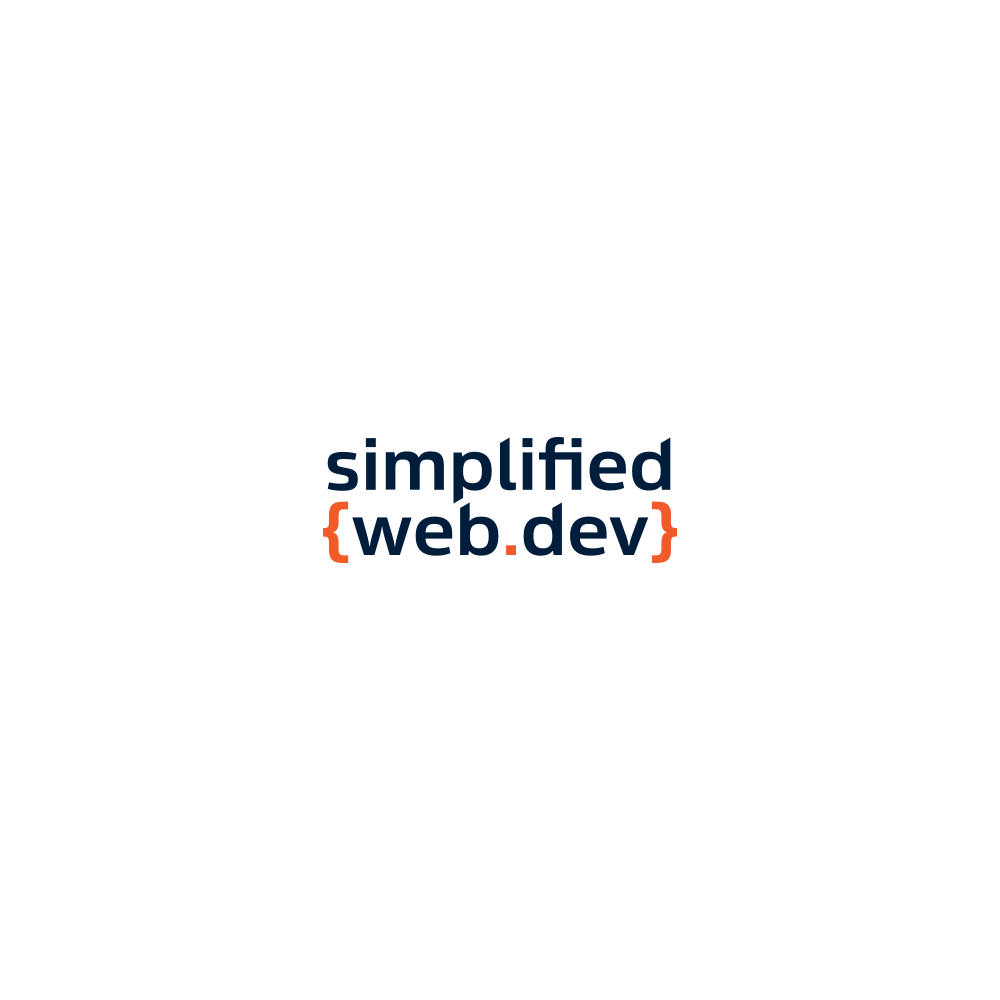
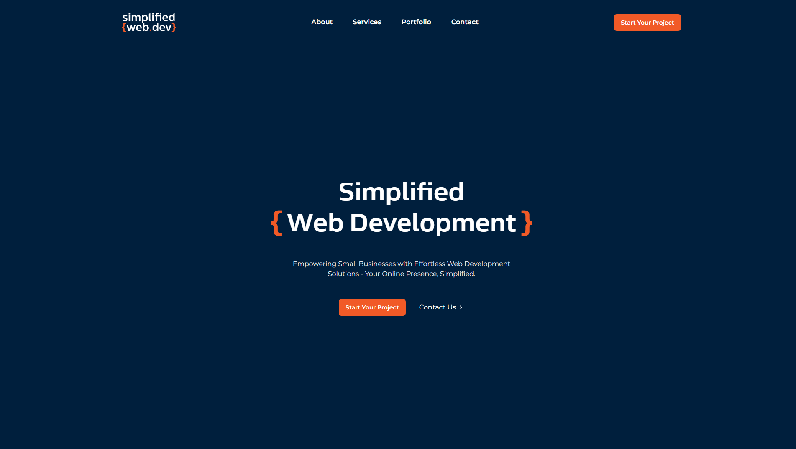

<div align="center">
  
</div>

<h4 align="center">
 Website for <a href="https://simplifiedweb.dev" target="_blank">Simplified Web.Dev</a>, a web development agency focused on building custom websites for small businesses on an affordable plan. Built with <a href="https://www.nextjs.org/" target="_blank">Next.js</a> and <a href="https://www.tailwindcss.com/" target="_blank">Tailwind CSS</a>, hosted on <a href="https://vercel.com/" target="_blank">Vercel</a>
</h4>

<p align="center">
  <a href="#how-to-use">How To Use</a> •
  <a href="#color-reference">Color Reference</a> •
  <a href="#license">License</a>
</p>



## How To Use

To clone and run this application, you'll need [Git](https://git-scm.com) and [Node.js](https://nodejs.org/en/download/) (which comes with [npm](http://npmjs.com)) installed on your computer. From your command line:

```bash
# Clone this repository
$ git clone git@github.com:oarnosa/simplifiedweb.dev.git

# Go into the repository
$ cd simplifiedweb.dev

# Install dependencies
$ npm install

# Run the app
$ npm run dev
```

## Color Reference

<table style="width:100%">
  <tr>
    <th>Color</th>
    <th>HEX</th>
    <th>RGB</th>
    <th>HLS</th>
  </tr>
  <tr align=center>
    <td>White</td>
    <td>#FFFFFF</td>
    <td>rgb(255, 255, 255)</td>
    <td>hls(0, 0%, 100%)</td>
  </tr>
  <tr align=center>
    <td>Black</td>
    <td>#0A0A0A</td>
    <td>rgb(10, 10, 10)</td>
    <td>hls(0, 0%, 3%)</td>
  </tr>
  <tr align=center>
    <td>Ligh Gray</td>
    <td>#E5E7EB</td>
    <td>rgb(229, 231, 235)</td>
    <td>hls(220, 13%, 90%)</td>
  </tr>
  <tr align=center>
    <td>Dark Blue</td>
    <td>#001E3D</td>
    <td>rgb(0, 30, 61)</td>
    <td>hls(210, 100%, 12%)</td>
  </tr>
  <tr align=center>
    <td>Orange</td>
    <td>#F15927</td>
    <td>rgb(241, 89, 39)</td>
    <td>hls(15, 88%, 55%)</td>
  </tr>
</table>

## License

- **[MIT License](http://opensource.org/licenses/mit-license.php)**
- All images, videos, logos, and assets are owned by <a href="http://simplifiedweb.dev" target="_blank">Simplified Web.Dev</a>.
